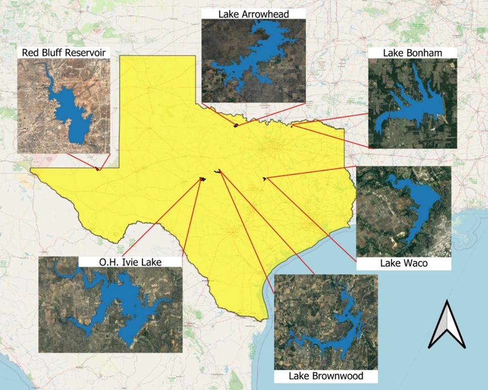
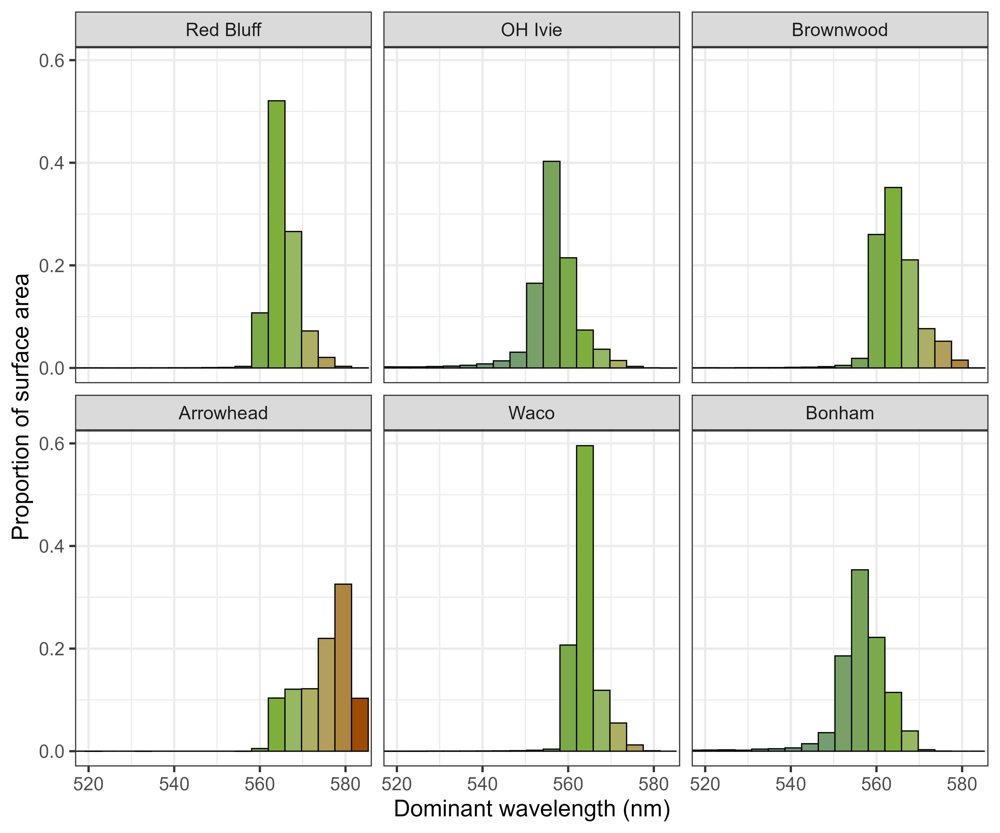

```{r setup, include=FALSE}
knitr::opts_chunk$set(echo = TRUE)

# clear workspace
rm(list=ls())

# 1. load essential packages

library(tidyverse)
library(data.table)
library(ggplot2)
library(ggpubr)
library(ggpmisc)
library(OpenStreetMap)
library(colorscience)
library(sf)
library(raster)
require(rasterVis)
require(RColorBrewer)
require(terrainr)
require(rstac)
require(terra)
library(nlme)
library(anytime)
library(patchwork)
library(ggforce)

# reading in the Sentinel-2 Cloud Probability masked sen2cor data along boat paths.
s2flm_nc<-read_csv("s2c_boatpath_pts.csv")

# reading in sentinel-2 ACOLITE L2W
s2flm_l2w<-read_csv("l2w6lakes.csv")

# reading in longitudinal transects
dfd_transect<- read_csv("dfd_transect.csv")

# reading in full system sen2cor using the ee.ImageCollection("COPERNICUS/S2_CLOUD_PROBABILITY") approach
dwl_cloudmask<-read_csv("dwl6lake_truecloudmask_bonthresh.csv")
dwl_cloudmask$dwlgroup<-factor(dwl_cloudmask$dwlgroup)

## 3. Preparing the plots

# First we have log10(turb) ~ NDTI plotted along the boat path for all lakes using sen2cor
s2c_turb_ndti_plot<-ggplot(s2flm_nc,aes(log10(turb), ndti)) + 
  geom_point() + 
  geom_smooth(method = "lm", se=FALSE) +
  stat_regline_equation(aes(label = ..rr.label..)) + 
  geom_abline(slope = 1, intercept = 0, linetype = "dashed", color = "red") +
  xlab("log10(Turbidity)") + ylab("Normalized Difference Turbidity Index") + theme_bw()

# plotting log10(turb) ~ NDTI along boat path for all lakes using ACOLITE L2W
l2w_turb_ndti_plot<-s2flm_l2w %>%  ggplot(aes(log10(turb), ndti)) + 
  geom_point() + 
  geom_smooth(method = "lm", se=FALSE) +
  stat_regline_equation(aes(label = ..rr.label..)) + 
  geom_abline(slope = 1, intercept = 0, linetype = "dashed", color = "red") +
  xlab("log10(Turbidity)") + ylab("Normalized Difference Turbidity Index") + theme_bw()

# plotting NDTI x norm DFD
dfd_transect$system<- factor(dfd_transect$system, levels = 
         c("redbluff","ohivie","brownwood","arrowhead","waco","bonham"))


line_ndti<- dfd_transect %>% ggplot(aes(norm_dist, ndti, color = system)) + geom_line(size=1.25) + 
  xlab("Normalized Distance from Dam") + ylab("Normalized Difference Turbidity Index") +  
  theme_bw()+scale_color_manual(values = viridis::viridis(6, option = "C"),
                                labels=c("bonham" = "Bonham", "waco"="Waco","brownwood"="Brownwood",
                                         "ohivie"="O.H. Ivie","redbluff"="Red Bluff","arrowhead"="Arrowhead"),
                                name = "System")+
  theme(axis.title.x = element_text(size = 15),
        axis.title.y = element_text(size = 15),
        legend.text = element_text(size = 10),
        legend.title = element_text(size = 12))

# plotting DWL x norm DFD
line_dwl<- dfd_transect %>% ggplot(aes(norm_dist, dwl, color = system)) + geom_line(size=1.25) + 
  xlab("Normalized Distance from Dam") + ylab("Dominant Wavelength") + theme_bw() +
  scale_color_manual(values = viridis::viridis(6, option = "C"),
                     labels=c("bonham" = "Bonham", "waco"="Waco","brownwood"="Brownwood",
                              "ohivie"="O.H. Ivie","redbluff"="Red Bluff","arrowhead"="Arrowhead"),
                     name = "System")+
  theme(axis.title.x = element_text(size = 15),
        axis.title.y = element_text(size = 15),
        legend.text = element_text(size = 10),
        legend.title = element_text(size = 12))

```

## R Markdown for MM Chapter 1

This is a streamlined document with essential data and figures for chapter 1 of MM's dissertation. The goal of this chapter is to characterize the spatial structure of **water clarity and color** for 6 reservoirs across the longitudinal gradient of Texas during the extreme drought of Summer 2022. From West to East this includes Red Bluff Reservoir, O.H. Ivie Lake, Lake Arrowhead, Lake Brownwood, Lake Waco, and Lake Bonham. All systems differ in their watershed characteristics and morphologies but we hypothesize similar patterns of optical properties along the "lotic to lentic continuum" typical of storage reservoirs.



This research project involves 3 types of data which include (1) continuous measurements of turbidity taken along the boat path and Secchi disk depth predicted from those values (2) discrete lab measurements of water samples taken at 4-6 stations (n=31) within each reservoir, variables include Secchi, AFDM, TN, TP, and Turbidity (3) Sentinel-2 surface reflectance (SR) data from the flyover date on the sampling date for all surveys except Lake Brownwood which was the day after but within 24 hours.

The three levels of spatial analysis include (1) Along the boat path (2) Longitudinal transects from dam to reservoir arm (3) Whole system using all water pixels within a lake's polygon. For spatial scale 1, the SR data used is from within 24 hours of survey. It is recommended to exclude the \~1500 points from Lake Waco that made it through filtering due to extensive sun glint on the survey data (7/23). For spatial scale 2, the SR data is for longitudinal transects from concurrent flyovers except for Lake Waco (7/25 instead of 7/23) and Lake Arrowhead (7/28 instead of 8/12), the same is true for the 3rd spatial scale of whole system. For the 3rd spatial scale, calculated DWL for the every water pixel using both the data product in GEE which was atmospherically corrected using Sen2Cor and also took the TOA data and corrected it to the Level-2 Water Product using ACOLITE.

## Let's look at some data:

First there is the relationship between turbidity along the boat path and NDTI for both the Sen2Cor and ACOLITE corrected products

```{r turb_ndti, echo=FALSE, warning=FALSE}
s2c_turb_ndti_plot

l2w_turb_ndti_plot
```

I used the relationship between turbidity and Secchi depth determined from the 2012 and 2017 NLA data to predict Secchi along the boat paths from our turbidity measurements. I wanted to do this because Secchi is a more intuitive measure of water clarity. The maps below show that for the most part there was lower clarity in the riverine compared to the lacustrine.


To look at longitudinal patterns, I queried the ee.points app with transects going from the dam into the riverine and used this to calculate NDTI and dominant wavelength through chromaticity analysis (happy to talk about this in detail if you are interested). This showed a relative increase in NDTI and a longer wavelengths corresponding with distance from the dam.

```{r dfd plots, echo=FALSE, warning=FALSE}
line_ndti

line_dwl
```

Next up we will look at some of the data related to the spatial structure of dominant wavelength. Running a two-way ANOVA (variable\~system+zone) showed significant zone effects across variables. Here are box-plots for both dominant wavelength and predicted Secchi.


That comparison was just for points along the boat path but I'm also interested in system-wide patterns. Here is each cloud-free water pixel plotted out by it's dominant wavelength colored by the FUI scale.


Although it is informative to see these patterns mapped out, we can dig a little deeper by looking at the distribution of water color throughout a system.



Visualizing it as a frequency plot we can see that for 5/6 of these lakes most of the surface area is some shade of green with the exception of the clay-dominated Lake Arrowhead. This indicates support for *autochthonization* under conditions with reduced flow due to a reduction in allochthonous inputs. We expect that during average to higher than average precipitation, a larger proportion of the surface area would reflect longer wavelengths such as brown and yellow, specifically associated with suspended solids. I propose a conceptual framework for categorizing lentic systems based off the very intuitive and relatively easy to calculate optical properties of water clarity and color. Below is a first stab at this, not to be included in this manuscript but for me to continue working through and eventually test out with large datasets, specifically for chapter 3.


The idea here is that the bottom corner has our oligotrophic lakes (blue, clear, low nutrients), the top section has low water clarity and long dominant wavelengths (brown to yellow) making these lakes light limited. In the larger middle portion corresponding with different shades of green is where I expect there to be high productivity (eutrophic) which can span a turbidity gradient.

Note that the `echo = FALSE` parameter was added to the code chunk to prevent printing of the R code that generated the plot.
