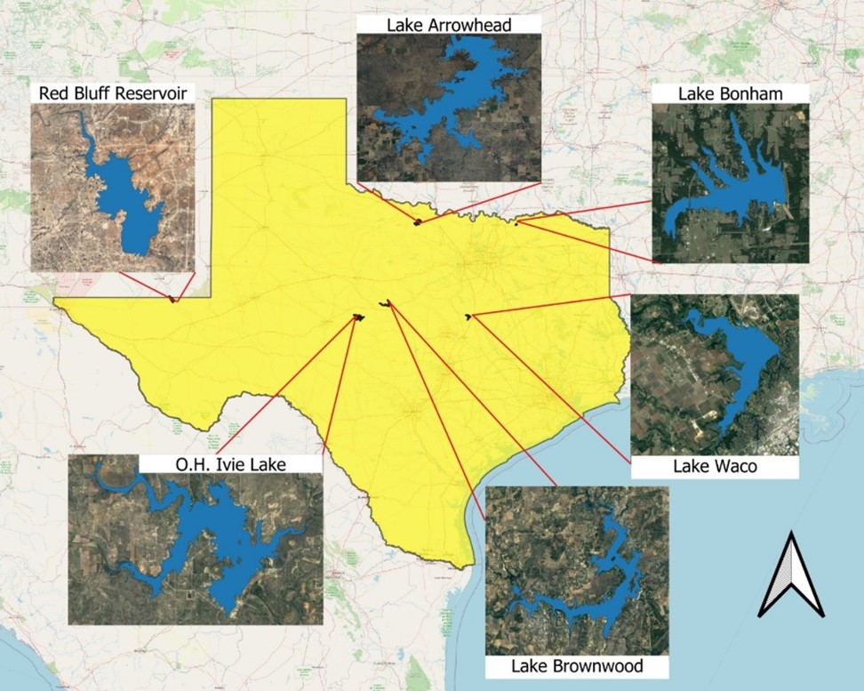

```{r setup, include=FALSE}
knitr::opts_chunk$set(echo = TRUE)

# clear workspace
rm(list=ls())

## 1. Loading in libraries
library(tidyverse)
library(data.table)
library(ggplot2)
library(ggpubr)
library(ggpmisc)
library(OpenStreetMap)
library(colorscience)
library(sf)
library(raster)
require(rasterVis)
require(RColorBrewer)
require(terrainr)
require(rstac)
require(terra)
library(nlme)
library(anytime)
library(patchwork)


## 2. Reading in data files

# First the Sen2Cor Sentinel-2 and YSI data along the boat path filtered to water only pixels, band 2 threshold > 300 determined from Bonham.
# Besides filters this data has already been categorized by zone for each reservoir and has DWL and NDTI. All are on sampling date.n=18317
s2flm_s2c_filter<-read_csv("six4m_zone_b2thresh.csv") %>% filter(SCL=="6") %>% filter(!system=="waco")

# Reading in the ACOLITE L2 Water Product data along the boat paths. n=25374
s2flm_l2w<-read_csv("l2w6lakes.csv")

# Next we load the longtudinal transect data queried from dam to arm on sampling date except AH and Waco (hi-qual imgs = 7/28 and 7/25)
dfd_transect<- read_csv("dfd_transect.csv")

# Now let's read in the YSI to CRASR lab measurement validation data set. AFDM missing for Ivie, Secchi for Waco.
# Mean YSI values were aggregated for all points in boat path falling within buffer around the station
sample_ysi<-read_csv("sensor_sample_valmeans.csv")

sample_ysi_secchi<-read_csv("valmeans_secchi.csv")

# Lastly we read in the Sentinel-2 to CRASR lab measurement data, station lat/lons were queried for hi-qual images.
s2crasr<-read_csv("s2crasr_merge.csv")

## 3. Preparing the plots

# First we have log10(turb) ~ NDTI plotted along the boat path for all lakes using sen2cor
s2c_turb_ndti_plot<-ggplot(s2flm_s2c_filter,aes(log10(turb), ndti)) + 
  geom_point() + 
  geom_smooth(method = "lm", se=FALSE) +
  stat_regline_equation(aes(label = ..rr.label..)) + 
  geom_abline(slope = 1, intercept = 0, linetype = "dashed", color = "red") +
  xlab("log10(Turbidity)") + ylab("Normalized Difference Turbidity Index") + theme_bw()

# plotting log10(turb) ~ NDTI along boat path for all lakes using ACOLITE L2W
l2w_turb_ndti_plot<-s2flm_l2w %>%  ggplot(aes(log10(turb), ndti)) + 
  geom_point() + 
  geom_smooth(method = "lm", se=FALSE) +
  stat_regline_equation(aes(label = ..rr.label..)) + 
  geom_abline(slope = 1, intercept = 0, linetype = "dashed", color = "red") +
  xlab("log10(Turbidity)") + ylab("Normalized Difference Turbidity Index") + theme_bw()

boatpath_turbndti_combo<- s2c_turb_ndti_plot + l2w_turb_ndti_plot +
  plot_annotation(tag_levels = 'A') 
#ggsave("turb_ndti_l2w_s2c.png", boatpath_turbndti_combo, width = 12, height = 5)

# Next we are plotting spatial scale 2 as distance from the dam, colored by lake
# NDTI x norm DFD
line_ndti<- dfd_transect %>% ggplot(aes(norm_dist, ndti, color = system)) + geom_line(size=1.25) + 
  xlab("Normalized Distance from Dam") + ylab("Normalized Difference Turbidity Index") +  
  theme_bw()+scale_color_manual(values = viridis::viridis(6, option = "C"),
                                labels=c("bonham" = "Bonham", "waco"="Waco","brownwood"="Brownwood",
                                         "ohivie"="O.H. Ivie","redbluff"="Red Bluff","arrowhead"="Arrowhead"),
                                name = "System")#+
  theme(axis.title.x = element_text(size = 15),
        axis.title.y = element_text(size = 15),
        legend.text = element_text(size = 10),
        legend.title = element_text(size = 12))

# DWL x norm DFD
line_dwl<- dfd_transect %>% ggplot(aes(norm_dist, dwl, color = system)) + geom_line(size=1.25) + 
  xlab("Normalized Distance from Dam") + ylab("Dominant Wavelength") + theme_bw() +
  scale_color_manual(values = viridis::viridis(6, option = "C"),
                     labels=c("bonham" = "Bonham", "waco"="Waco","brownwood"="Brownwood",
                              "ohivie"="O.H. Ivie","redbluff"="Red Bluff","arrowhead"="Arrowhead"),
                     name = "System")#+
  theme(axis.title.x = element_text(size = 15),
        axis.title.y = element_text(size = 15),
        legend.text = element_text(size = 10),
        legend.title = element_text(size = 12))

#combining the two plots
comb_linedfd_plot<- line_ndti + line_dwl + plot_layout(guides = "collect") & theme(legend.position = "right")

# Now let's make plots for relationships between mean YSI values and lab measurements
# First we have YSI turb to lab turb
turb_stations <-ggplot(sample_ysi,aes(y=turb_ysi_m,x=turb_lab)) + 
  geom_point(aes(color = system)) + 
  geom_smooth(method = "lm", formula = y ~ x, color = "black") +
  stat_poly_eq(formula = y ~ x, 
               aes(label = paste(after_stat(rr.label))), 
               parse = TRUE, label.x.npc = "left", size = 5, rr.digits = 3) + 
  geom_abline(slope = 1, intercept = 0, linetype = "dashed", color = "red") + 
  ylab("Sensor Turbidity (NTU)")+
  xlab("Sample Turbidity (NTU)")+ theme_bw()
ggsave("turb_stations.png", turb_stations)

# Now it's predicted Secchi to in situ Secchi
sdd_stations<-sample_ysi_secchi %>% filter(!system =="Lake Waco") %>% 
  ggplot(aes(y=pred_sdd_m,x=secchi)) + 
  geom_point(aes(color = system)) + 
  geom_smooth(method = "lm", formula = y ~ x, color = "black") +
  stat_poly_eq(formula = y ~ x, 
               aes(label = paste(after_stat(rr.label))), 
               parse = TRUE, label.x.npc = "left", size = 5, rr.digits = 3) + 
  geom_abline(slope = 1, intercept = 0, linetype = "dashed", color = "red") +
  ylab("Predicted Secchi (m)")+
  xlab("Secchi (m)")+ theme_bw()

comb_sampsens_plot<- turb_stations + sdd_stations + plot_layout(guides = "collect") & theme(legend.position = "right")
ggsave("sdd_turb_stations.png", comb_sampsens_plot, width = 15, height = 7)

# Predicted Sechi to YSI turb
ggplot(sample_ysi_secchi,aes(y=pred_sdd_m,x=turb_ysi_m)) +
  geom_point(aes(color = system)) +
  stat_poly_eq(formula = y ~ x,
               aes(label = paste(after_stat(rr.label))),
               parse = TRUE, label.x.npc = "left", size = 5, rr.digits = 3) + ylab("Predicted Secchi (m)")+
  xlab("Sensor Turbidity (NTU)")+ theme_bw()

# Field Secchi to lab turb
ggplot(sample_ysi_secchi,aes(y=secchi,x=turb_lab)) +
  geom_point(aes(color = system)) +
  stat_poly_eq(formula = y ~ x,
               aes(label = paste(after_stat(rr.label))),
               parse = TRUE, label.x.npc = "left", size = 5, rr.digits = 3) + ylab("Secchi (m)")+
  xlab("Sample Turbidity (NTU)")+ theme_bw()

# testing out AFDM relationships
s2crasr %>% ggplot(aes(afdm, dwl)) + geom_point()


## 4. Running linear models and preparing summary tables
```

## R Markdown for MM Chapter 1

This is a streamlined document with essential data and figures for chapter 1 of MM's dissertation. The goal of this chapter is to characterize the spatial structure of **water clarity and color** for 6 reservoirs across the longitudinal gradient of Texas during the extreme drought of Summer 2022.



This research project involves 3 types of data which include (1) continuous measurements of turbidity taken along the boat path and Secchi disk depth predicted from those values (2) discrete lab measurements of water samples taken at 4-6 stations (n=31) within each reservoir, variables include Secchi, AFDM, TN, TP, and Turbidity (3) Sentinel-2 surface reflectance (SR) data from the flyover date on the sampling date for all surveys except Lake Brownwood which was the day after but within 24 hours.

The three levels of spatial analysis include (1) Along the boat path (2) Longitudinal transects from dam to reservoir arm (3) Whole system using all water pixels within a lake's polygon. For spatial scale 1, the SR data used is from within 24 hours of survey. It is recommended to exclude the \~1500 points from Lake Waco that made it through filtering due to extensive sun glint on the survey data (7/23). For spatial scale 2, the SR data is for longitudinal transects from concurrent flyovers except for Lake Waco (7/25 instead of 7/23) and Lake Arrowhead (7/28 instead of 8/12), the same is true for the 3rd spatial scale of whole system. For the 3rd spatial scale, calculated DWL for the every water pixel using both the data product in GEE which was atmospherically corrected using Sen2Cor and also took the TOA data and corrected it to the Level-2 Water Product using ACOLITE.

Refer to setup in the "chapter1.rmd" or "ch1pts.R" files to see the reading in of necessary data files and preparation of the plots visualized below. First, let's look at the means of turbidity, predicted Secchi, dominant wavelength, and normalized difference turbidity index per lake to get a sense of variability.

```{r means_table}
summary(cars)
```

## Visualizing Plots

```{r turb_ndti, echo=FALSE, flag=FALSE}

boatpath_turbndti_combo

s2c_turb_ndti_plot

s2flm_l2w %>%  ggplot(aes(turb, ndti)) + 
  geom_point() + 
  geom_smooth(method = "lm", se=FALSE) +
  stat_regline_equation(aes(label = ..rr.label..)) + 
  geom_abline(slope = 1, intercept = 0, linetype = "dashed", color = "red") +
  xlab("log10(Turbidity)") + ylab("Normalized Difference Turbidity Index") + theme_bw()

```

```{r dfd_lines, echo=FALSE, flag=FALSE}
comb_linedfd_plot
```

```{r testing plots, echo=FALSE, flag=FALSE}
comb_sampsens_plot
ggsave("sdd_turb_stations.png", comb_sampsens_plot, width = 15, height = 7)

#sdd_stations

# ggplot(sample_ysi_secchi,aes(y=pred_sdd_m,x=turb_ysi_m)) +
#   geom_point(aes(color = system)) +
#   stat_poly_eq(formula = y ~ x,
#                aes(label = paste(after_stat(rr.label))),
#                parse = TRUE, label.x.npc = "left", size = 5, rr.digits = 3) + ylab("Predicted Secchi (m)")+
#   xlab("Sensor Turbidity (NTU)")+ theme_bw()
```

```{r test_plots_s2crasr, echo = FALSE}
dwl_ndti_allstations<-s2crasr %>% filter(dwl>500) %>% ggplot(aes(y=dwl,x=ndti)) +
  geom_point(aes(color = system)) +
  #geom_smooth(method = "lm", formula = y ~ x, color = "black") +
  stat_poly_eq(formula = y ~ x,
               aes(label = paste(after_stat(rr.label))),
               parse = TRUE, label.x.npc = "left", size = 5, rr.digits = 3) + ylab("dwl")+
  xlab("ndti")+ theme_bw()
#ggsave("dwl_ndti_rmoutlier.png", dwl_ndti_allstations)

s2crasr %>% ggplot(aes(y=dwl,x=afdm)) +
  geom_point(aes(color = system)) +
  #geom_smooth(method = "lm", formula = y ~ x, color = "black") +
  stat_poly_eq(formula = y ~ x,
               aes(label = paste(after_stat(rr.label))),
               parse = TRUE, label.x.npc = "left", size = 5, rr.digits = 3) + ylab("dwl")+
  xlab("afdm")+ theme_bw()

```
``` {r testplots_afdm, echo = FALSE}
afdm_dwl_stations<-s2crasr %>% ggplot(aes(y=dwl,x=ndti, color=system))+ geom_point()+
  # geom_smooth(method="lm")+
  ylab("Dominant Wavelength (nm)")+
  xlab("Ash Free Dry Mass (mg/L)")+
  theme_bw()
#ggsave("afdm_dwl_stations_noline.png", afdm_dwl_stations)

s2crasr %>% ggplot(aes(y=dwl,x=afdm, color=system))+ geom_point()+
  stat_poly_eq(formula = y ~ x,
               aes(label = paste(after_stat(rr.label))),
               parse = TRUE, label.x.npc = "left", size = 5, rr.digits = 3)+
  # geom_smooth(method="lm")+
  # ylab("Dominant Wavelength (nm)")+
  # xlab("Ash Free Dry Mass (mg/L)")+
  theme_bw()
```

Note that the `echo = FALSE` parameter was added to the code chunk to prevent printing of the R code that generated the plot.
