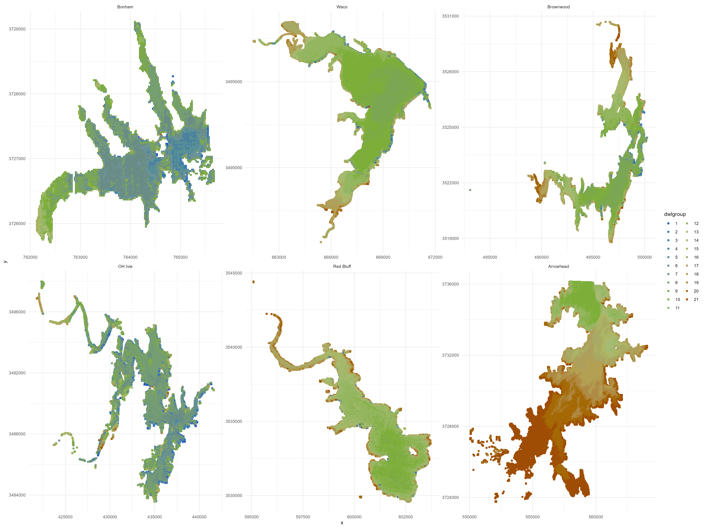
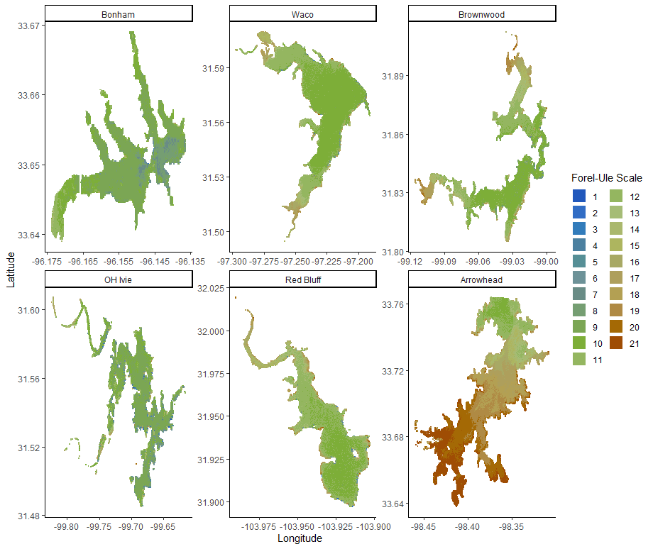
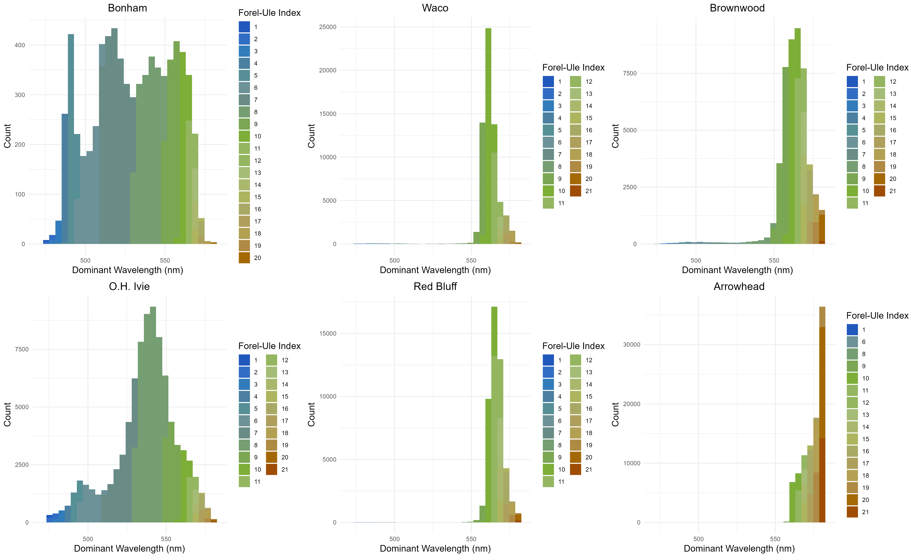
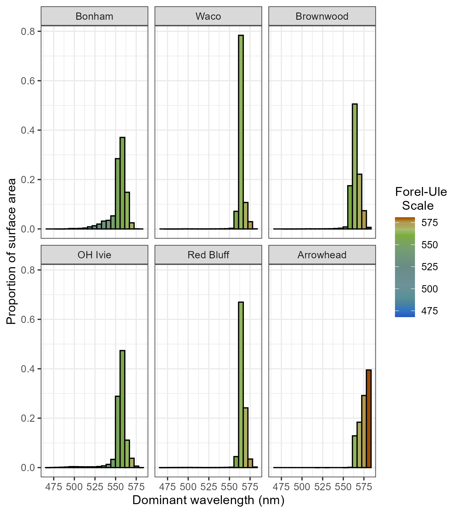

```{r setup, include=FALSE}
library(tidyverse)
library(ggpubr)

knitr::opts_chunk$set(echo = TRUE)

s2flame_znpts<-read_csv("s2flm6lakes_nfu_4mzone.csv") 

s2flm_nc<-read_csv("s2cloudprob_flame_pts.csv")

s2flm_l2w<-read_csv("l2w6lakes.csv")
```

## Updates

This is RMarkdown is to summarize the changes in results that have occurred since we last met. Overall I feel these are positive developments since my confidence in the quality of the data/analysis has been increased, the system-wide color results even seem to further support our argument for autochthonization. I will include some of the prior results followed by the revisions so that you may compare them side by side. This document is subject to changes depending on what we find useful.

### Water color at the whole system level

In reviewing my chromaticity code in Google Earth Engine and scrutinizing the results specifically for O.H. Ivie, I noticed that there were some portions of clouds and shadows for which DWL was being calculated. This is due to the commonly applied maskS2clouds function not fully identifying all pixels that have cloud/shadow contamination. In reviewing alternative cloud masking approaches, I came across the "Sentinel-2: Cloud Probability" ee.Image.Collection ("COPERNICUS/S2_CLOUD_PROBABILITY") which can be combined with the Sen2Cor corrected data ("COPERNICUS/S2_SR_HARMONIZED") to produce much more accurate identification and exclusion of clouds and associated shadows.

The pixels that had previously been misclassified as water but were actually clouds tended to reflect in the blue spectrum as seen in this mapped out figure. Comparing it with the maps that actually only calculate for cloud-free water pixels we can see clearly where some of those clouds were included:



Here is the updated plot where you can see significant portions of Bonham and Ivie excluded and hardly very little blue for any of the lakes compared to above.



Now looking at the histograms, previously our distribution was only visualized by count:



Besides updating the actual cloud free color distribution, we also updated the histogram to show proportion of total area for each range of wavelengths. This shows clearly what our results paragraph states about how much of the surface area reflects green (550-570, FUI 9-14) compared to above that (yellow-brown) or below that (blue-green to blue), the latter categories are the minority for all lakes.



### Looking at NDTI to Turbidity from Sen2Cor vs. ACOLITE

Our approach to Sen2Cor has been pretty non-standardized and might still need some work to address the concerns about poor model fit. I decided to use the same approach I took to the ACOLITE data and query the Sentinel2CloudProb images for points along boat path in R and did not get a much stronger correlation than we were finding with our own piecemeal approach.

```{r s2flm_eepts, warning=FALSE}
s2flame_znpts %>% dplyr::group_by(system) %>% dplyr::summarise(count = n())

s2flm_allfilter<-s2flame_znpts  %>% filter(SCL == "6")%>% 
  filter(!system=="waco")

ggplot(s2flm_allfilter,aes(turb, ndti)) + 
  geom_point() + 
  geom_smooth(method = "lm", se=FALSE) +
  stat_regline_equation(aes(label = ..rr.label..)) + theme_bw()

ggplot(s2flm_allfilter,aes(turb, ndti, color=system)) + 
  geom_point() + 
  geom_smooth(method = "lm", se=FALSE) +
  stat_regline_equation(aes(label = ..rr.label..)) + theme_bw()

```

When we exclude the 1588 Waco points from the total of 28328 the r2 goes from 0.57 to 0.7 for the sen2cor data downloaded from ee.points app and similar flagging approach to Arrowhead paper.

The following data is for the cloud prob data where band values were extracted in R. Without excluding Waco the r2 is 0.52 compared to 0.56 when those 1201 points were excluded. The total n = 27820.

```{r s2flm_cloudprob, warning=FALSE}
s2flm_nc %>% dplyr::group_by(system) %>% dplyr::summarise(count = n())

s2flm_ncfilter<-s2flm_nc  %>%
  filter(!system=="waco")

ggplot(s2flm_ncfilter,aes(turb, ndti)) + 
  geom_point() + 
  geom_smooth(method = "lm", se=FALSE) +
  stat_regline_equation(aes(label = ..rr.label..)) + theme_bw()

ggplot(s2flm_ncfilter,aes(turb, ndti, color =system)) + 
  geom_point() + 
  geom_smooth(method = "lm", se=FALSE) +
  stat_regline_equation(aes(label = ..rr.label..)) + theme_bw()
```

Next up you can see that when plotting the ACOLITE L2W data, it automatically excludes 10647 points because the NDTI comes up as NA. The summarise(count = n()) below shows how many of those points are excluded for each lake, this includes all from Waco.

```{r l2w, warning=FALSE}
s2flm_l2w %>% dplyr::group_by(system) %>% dplyr::summarise(count = n())

ggplot(s2flm_l2w,aes(turb, ndti)) + 
  geom_point() + 
  geom_smooth(method = "lm", se=FALSE) +
  stat_regline_equation(aes(label = ..rr.label..)) + theme_bw()

ggplot(s2flm_l2w,aes(turb, ndti, color =system)) + 
  geom_point() + 
  geom_smooth(method = "lm", se=FALSE) +
  stat_regline_equation(aes(label = ..rr.label..)) + theme_bw()

s2flm_l2w_nona<-s2flm_l2w %>% drop_na()

s2flm_l2w_nona %>% dplyr::group_by(system) %>% dplyr::summarise(count = n())
```

```{r qq plot, warning=FALSE}
s2c_lm = lm(turb~ndti, s2flm_allfilter)
summary(s2c_lm)

plot(s2c_lm, which = c(1,2))
```
